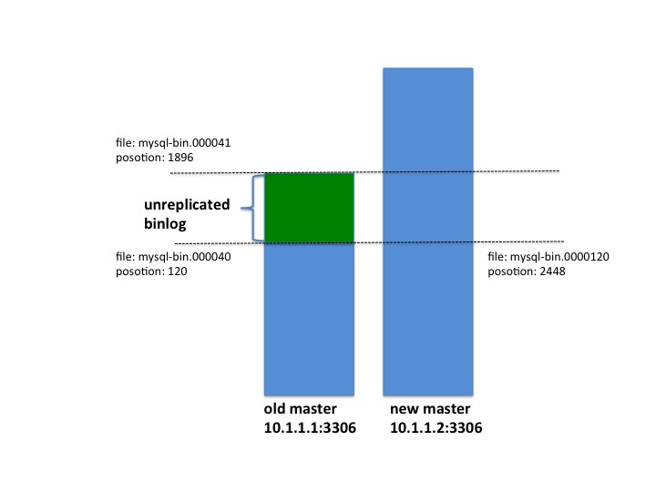

MySQL主从切换后如何进行数据修复
========================

目前的MySQL高可用方案多是基于replication实现。MySQL replication默认是异步复制，它有个重要缺陷：主从延迟。当出现主从延迟时，如果master出现宕机且无法将全部数据发送至slave，则slave将丢失这部分数据。半同步复制和同步复制能避免主从延迟发生，但会使得性能大大下降，以至于诸多采用mysql存储的高性能系统仍旧采用异步复制。本文对主从切换后的数据不一致提供了一种新的解决办法。

### 主从切换后的状态

如下图所示，切换完成后，old master(10.1.1.1:3306)有一部分binlog(unreplicated binlog)未同步到new master(10.1.1.2:3306)，new master已经有新数据进入。此时，主从数据已经不一致。



### 常见办法
将old master指向new master，开启同步。执行命令如下：

```bash
> CHANGE MASTER TO MASTER_HOST='10.1.1.2', MASTER_PORT=3306,  MASTER_USER='xxx', MASTER_PASSWORD=xxx;
> CHANGE MASTER TO master_log_file='mysql-bin.000001',master_log_pos= 2448; 
> start slave;
```
此时一般会报错duplicate entry for key 'primary'。DBA们往往会选择以下几种方式来处理， 

1. 粗暴跳过所有错误，直到复制不再报错。
 
	缺点：主从数据不一致，留下安全隐患。

2. 根据报错信息，逐次修old master数据。如报duplicate entry for key 'primary' for table a where id=12345, 则将old master 表a id=12345的数据删除，再继续开启同步。

	缺点：手工修复起来繁琐；unreplicated binlog部分事务丢失；如果unreplicated binlog较多的话，主从数据很大概率还是会不一致。

3. 将old master回滚至mysql-bin.00040 120，再开启同步。同步正常。 
 
	缺点：unreplicated binlog丢失。

### 新办法
**步骤**

1. 提取old master未同步的数据，并对其中的insert语句去除主键（为了防止步骤3中出现主键冲突）；
2. 将old master回滚至mysql-bin.00040 120，开启同步。同步正常；
3. 在new master重新导入改造后的sql；

我们使用了纯Python开发的工具[binlog2sql](https://github.com/danfengcao/binlog2sql)来操作，执行命令如下

```bash
$ python binlog2sql.py --popPk -h10.1.1.1 -P3306 -uadmin -p'admin' --start-file='mysql-bin.000040' --start-pos=125466 --end-file='mysql-bin.000041' > oldMaster.sql

$ python binlog2sql.py --flashback -h10.1.1.1 -P3306 -uadmin -p'admin' --start-file='mysql-bin.mysql-bin.000040' --start-pos=125466 --end-file='mysql-bin.000041' | mysql -h10.1.1.1 -P3306 -uadmin -p'admin'

$ mysql -h10.1.1.2 -P3306 -uadmin -p'admin' < oldMaster.sql
```

**优点**

数据丢失最少，操作简单快捷。

**限制**

如果表的主键id是有业务含义的，则务必与业务方确认可行后再操作。


###参考文献
[1] 易固武, [MySQL数据库的高可用性分析](https://www.qcloud.com/community/article/203)

[2] 曹单锋, [Parse MySQL binlog to SQL you want](https://github.com/danfengcao/binlog2sql)